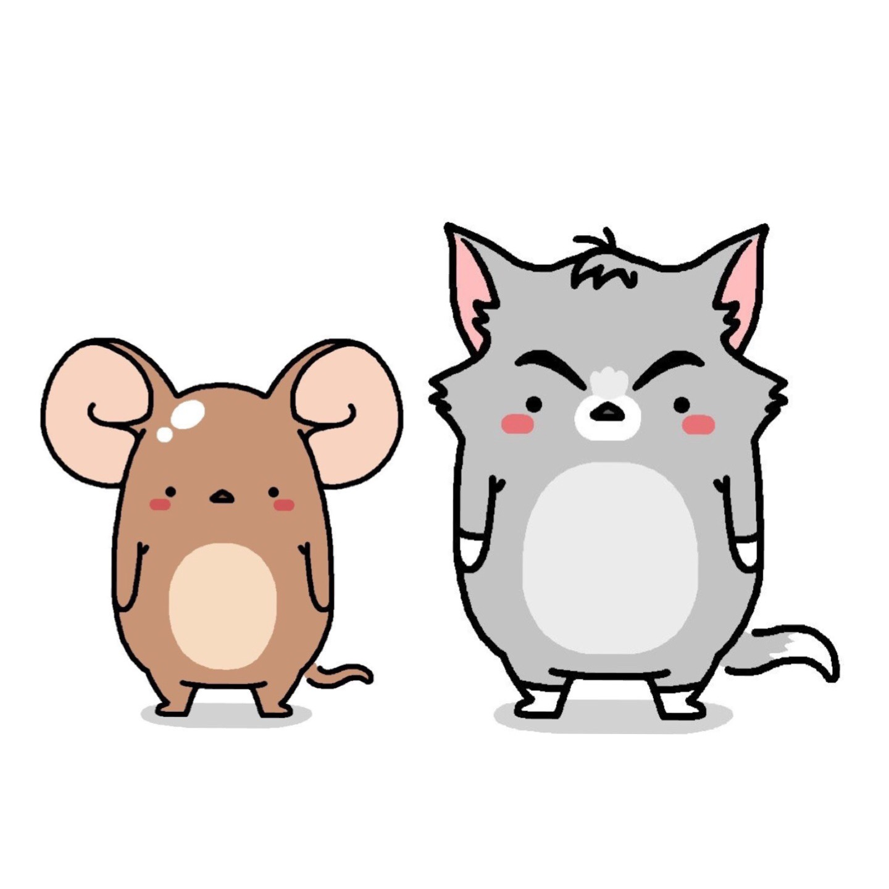
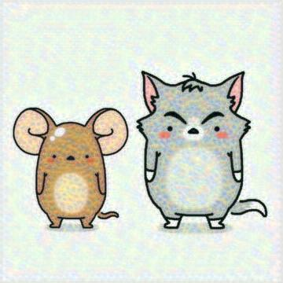
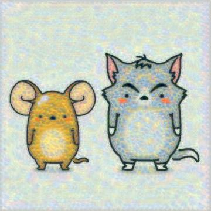
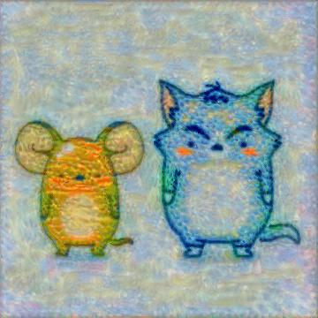
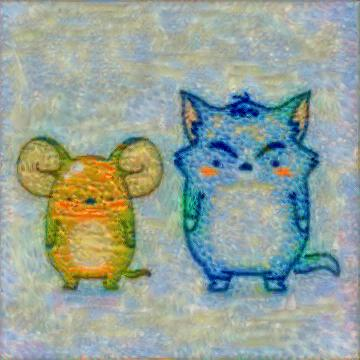

# Style Transfer Using PyTorch
---

- Content Image

- Style Image

- 변화 과정  
**500 Step**  
  
**1000 Step**  
  
**1500 Step**  
  
**2000 Step**  
  
**2500 Step**  
  
**3000 Step**  
  
**3500 Step**  
  
**4000 Step**  
  
**4500 Step**  
  
**5000 Step**  
   